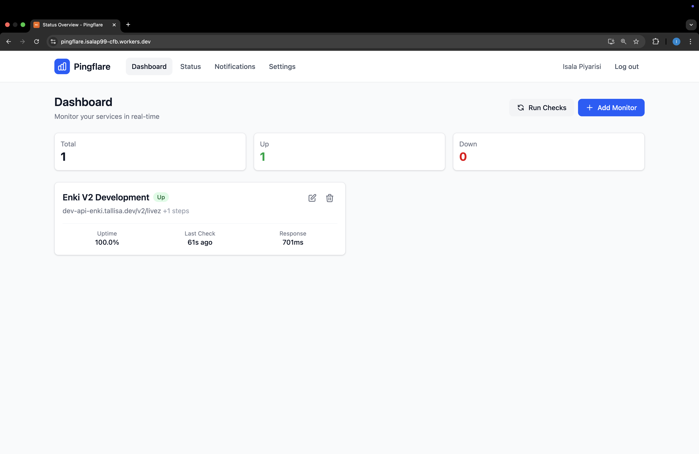
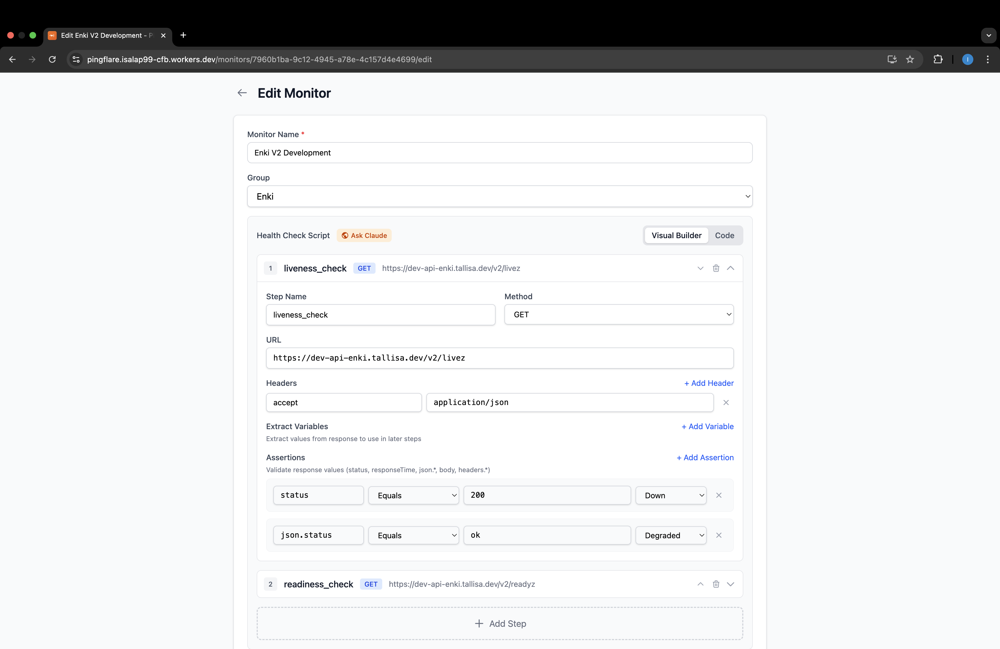
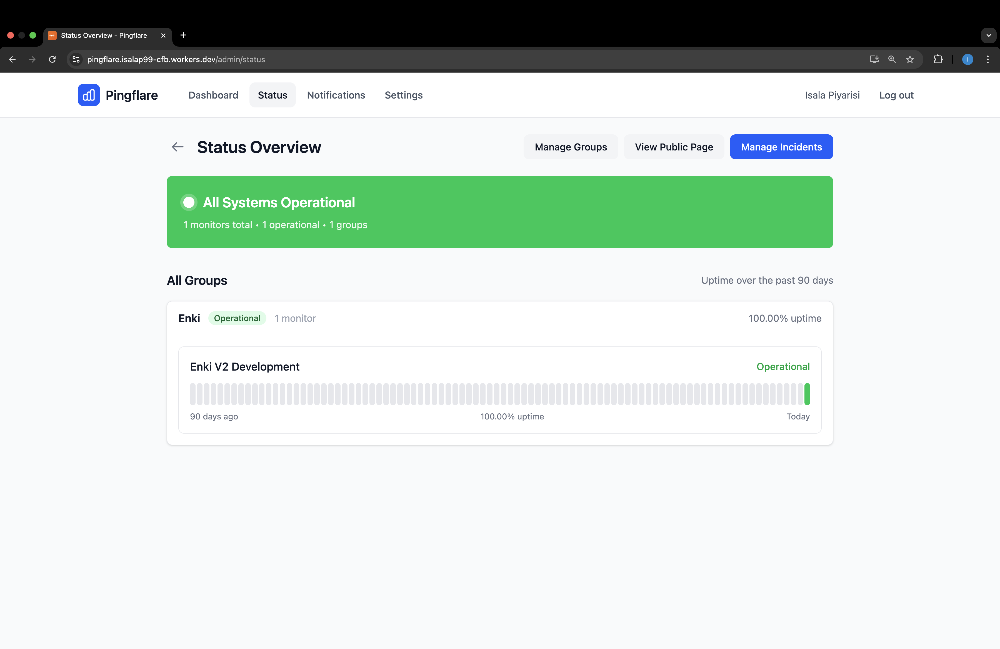
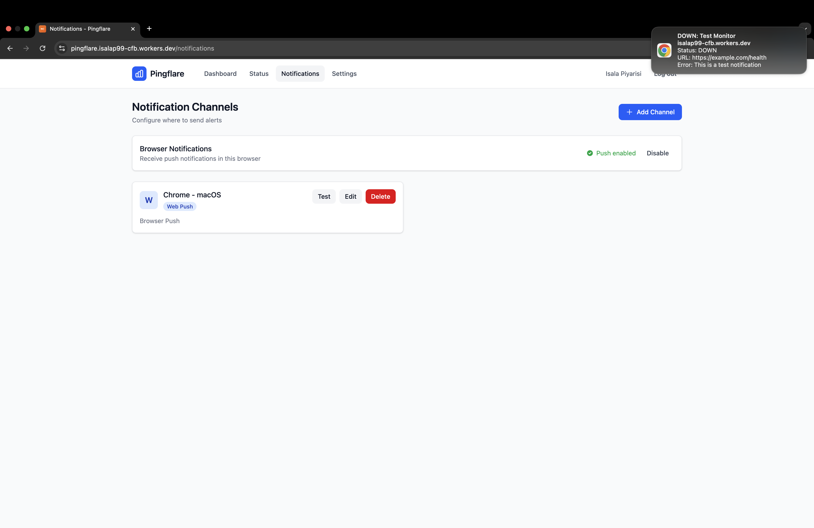

# Pingflare

[](https://deploy.workers.cloudflare.com/?url=https://github.com/isala404/pingflare)

Self-hosted uptime monitoring that runs entirely on Cloudflare's edge network. No servers to maintain, no infrastructure to manage — just click deploy.



## Why Pingflare?

- **Truly self-hosted** — All data stays in your Cloudflare account. No external dependencies.
- **Zero infrastructure** — Runs on Cloudflare Workers + D1. No VMs, no containers, no maintenance.
- **Global monitoring** — Health checks run from Cloudflare's edge, giving you real external monitoring.
- **Free tier friendly** — Works within Cloudflare's free tier for up to ~25 monitors.

## Features

### Health Checks

Build sophisticated monitoring without writing code:

- **Multi-step scripts** — Chain requests with variable extraction (login → get token → check API)
- **Visual builder** — Point-and-click health check configuration
- **Flexible assertions** — Validate status codes, response times, JSON paths, headers
- **Severity levels** — Mark services as degraded or down based on different conditions



### Status Pages

Share your service status with users:

- **Public status pages** — Shareable URL at `/status`
- **Monitor groups** — Organize services logically (API, Web, Database)
- **90-day history** — Visual uptime bars showing daily status
- **Incident management** — Create incidents, post updates, track resolution



### Notifications

Get alerted when things break:

- **Multiple channels** — Slack, Discord, webhooks, and browser push
- **PWA support** — Install Pingflare on your phone and receive native push notifications
- **Per-monitor config** — Choose which alerts go where



### Security

- **Session-based auth** — Secure login with email/password
- **Role-based access** — Admin, Editor, and Viewer roles
- **Protected APIs** — All admin endpoints require authentication
- **Secure cron** — Scheduled health checks use a secret token (not exposed in repo)
- **Your infrastructure** — Data never leaves your Cloudflare account

## Quick Start

### One-Click Deploy

1. Click the **Deploy to Cloudflare** button above
2. Authorize Cloudflare to access your GitHub
3. Click Deploy — Cloudflare handles the rest
4. Set the cron secret (required for scheduled health checks):
5. Visit your Worker URL and create an admin account

### Manual Setup

```bash
git clone https://github.com/isala404/pingflare.git
cd pingflare
bun install
wrangler login
wrangler d1 create pingflare-db
# Update wrangler.toml with your database ID
bun run build && bun run deploy

# Set the cron secret (required for scheduled health checks)
openssl rand -hex 32 | wrangler secret put CRON_SECRET
```

## Local Development

```bash
bun install
bun run dev      # Start dev server at localhost:5173
bun test         # Run tests
bun run check    # Type checking
```

## Limitations

- **~25 monitors** — Cloudflare's 50 subrequest limit per cron invocation
- **1-minute intervals** — Minimum check frequency (Cloudflare cron limitation)
- **Free tier** — 100k requests/day, 10ms CPU/request

## Contributing

Contributions welcome! Feel free to open issues and pull requests.

## License

MIT
